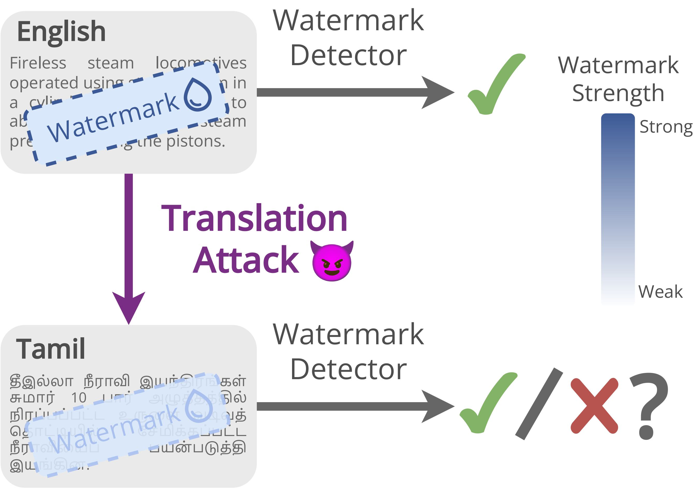
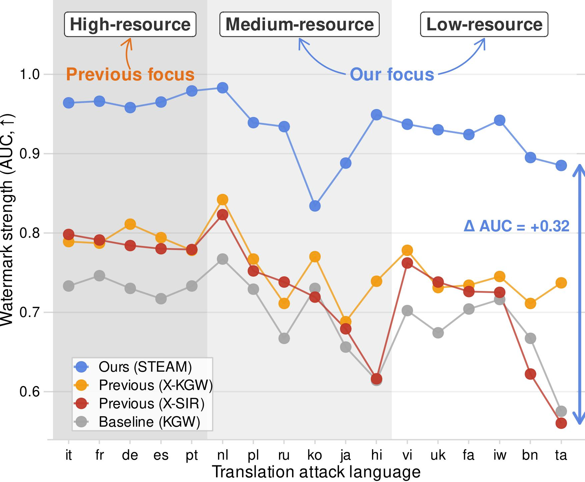
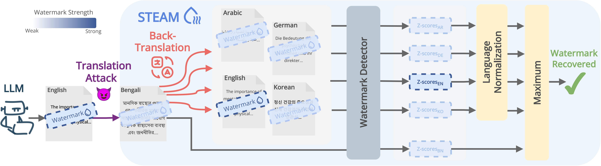

<div align="center">

# STEAM : Simple Translation-Enhanced Approach for Multilingual Watermarking

[](https://arxiv.org/abs/2510.18019)</br>
<a href="https://www.linkedin.com/in/asim-mohamed-9a2047135/"><b>Asim Mohamed</b></a>, <a href="https://gubri.eu/"><b>Martin Gubri</b></a></br>
African Institute for Mathematical Sciences (AIMS), Parameter Lab

---

</div>

Official implementation of [**"Is Multilingual LLM Watermarking Truly Multilingual? A Simple Back-Translation Solution"**](https://arxiv.org/abs/2510.18019).

In this work, we introduce STEAM (Simple Translation-Enhanced Approach for Multilingual watermarking), a novel defense mechanism designed to enhance the robustness of LLM watermarks against translation-based attacks.

The work was supported by [Parameter Lab](https://parameterlab.de), which provided the compute resources and covered the API costs of large language models.

## Table of Contents

- [Overview](#overview)
  - [1. Motivation](#1-motivation)
  - [2. STEAM](#2-steam-)
- [Installation](#installation)
- [Basic Workflow](#basic-workflow)
  - [Categories](#categories)
- [Code Structure](#code-structure)
- [Core Components](#core-components)
  - [1. Text Generation (`gen.py`)](#1-text-generation-genpy-)
  - [2. Watermark Detection (`detect.py`)](#2-watermark-detection-detectpy)
  - [3. Evaluation (`eval_detection.py`)](#3-evaluation-eval_detectionpy)
- [Evaluation Workflow](#evaluation-workflow)
- [Configuration](#configuration)
- [Cite](#cite)

## Overview

### 1. Motivation

<p align="center">
  
  &nbsp;&nbsp;&nbsp;
  
</p>

> Existing multilingual watermarking methods, such as X-SIR, claim cross-lingual robustness but have been tested almost exclusively on high-resource languages. When evaluated across a wider range of languages, these methods fail to maintain watermark strength under translation attacks—especially for medium- and low-resource languages like Tamil or Bengali.
>
> This degradation arises because semantic clustering (grouping equivalent words like “house–maison–casa”) depends heavily on tokenizer coverage: languages with fewer full-word tokens lose semantic alignment, making watermarks fragile to translation.
>
> These findings reveal that current multilingual watermarking is not truly multilingual, as robustness collapses when token coverage decreases or when text is translated into underrepresented languages

### 2. STEAM 



> STEAM addresses this limitation with a simple, detection-time defense that uses multilingual back-translation to recover watermark signals lost during translation.
>
> Given a suspect text, STEAM translates it back into multiple supported languages, evaluates each version using a standard watermark detector (e.g., KGW), applies language-specific z-score normalization, and takes the maximum normalized score as the decisive signal.
> This process effectively restores watermark strength regardless of language or tokenizer. Across 17 diverse languages, STEAM achieves up to +0.33 AUC and +64.6 percentage-point TPR@1% gains over prior methods, remaining robust even under translator mismatches and multi-step translation attacks.
>
> In essence, STEAM provides a model-agnostic, non-invasive, and retroactively extensible defense that ensures fair watermark detection across high-, medium-, and low-resource languages.

## Installation

This project requires **Python 3.10.17**.

### 1. Create and activate a virtual environment

```bash
python3.10 -m venv .venv
source .venv/bin/activate
```

### 2. Install dependencies

```bash
pip install -r requirements.txt
```

## Overview

STEAM is designed as a plug-in defense layer that works with existing watermarking frameworks such as **X-SIR**, **X-KGW**, and **KGW**.

---

## Basic Workflow

```bash
# 1. Prepare bilingual dictionaries
bash data/dictionary/download_dictionaries.sh new_supported
bash data/dictionary/build_dictionaries.sh new_supported

# 2. Generate semantic mappings
bash evaluation/scripts/generate_mapping.sh new_supported

# 3. Generate watermarked and human text
bash evaluation/scripts/generate_watermark.sh new_supported
bash evaluation/scripts/generate_human.sh new_supported

# 4. Evaluate detection performance
bash evaluation/scripts/evaluate_detection.sh new_supported
```

### Categories

| Category             | Description                                                              |
| -------------------- | ------------------------------------------------------------------------ |
| `new_supported`      | Run experiments with the new set of supported languages                  |
| `original_supported` | Use only the original supported languages (`en`, `fr`, `de`, `zh`, `ja`) |
| `unsupported`        | Evaluate unsupported languages                                           |

Languages for each category can be configured in `evaluation/common/languages.sh` files.

---

## Code Structure

```
STEAM/
├── gen.py                        # Generate watermarked text
├── detect.py                     # Compute z-scores for detection
├── utils.py                      # Shared utility functions
│
├── data/
│   ├── dataset/                  # MC4 prompts (en, fr, de, zh, etc.)
│   ├── dictionary/               # Bilingual dictionaries (MUSE-based)
│   ├── mapping/                  # Semantic mappings (X-SIR / X-KGW)
│   └── model/                    # Pretrained transform models
│
├── evaluation/
│   ├── scripts/                  # Automated generation & evaluation scripts
│   ├── common/                   # Shared configs (models, languages)
│   └── eval_detection.py         # Computes AUC, TPR@FPR, F1
│
└── watermarks/
    ├── xsir/                     # X-SIR implementation
    ├── xkgw/                     # X-KGW implementation
    └── kgw/                      # KGW implementation
```

---

## Core Components

### 1. Text Generation (`gen.py`)

Generates watermarked or baseline text from prompts.

#### Example: Generate X-SIR Watermarked Text

```bash
python gen.py \
  --base_model meta-llama/Llama-3.2-1B \
  --input_file data/dataset/mc4.en.jsonl \
  --output_file evaluation/gen/llama-3.2-1B/new_supported/xsir_seed0/mc4.en.mod.jsonl \
  --watermark_method xsir \
  --watermark_type context \
  --mapping_file data/mapping/xsir/new_supported/mapping.json \
  --transform_model data/model/transform_model_x-sbert.pth
```

**Key Arguments**

- `--watermark_method`: `xsir`, `xkgw`, `kgw`, or `none`
- `--mapping_file`: Required for X-SIR and X-KGW methods

---

### 2. Watermark Detection (`detect.py`)

Computes z-scores for watermark detection.

#### Example

```bash
python detect.py \
  --base_model meta-llama/Llama-3.2-1B \
  --detect_file evaluation/gen/llama-3.2-1B/new_supported/xsir_seed0/mc4.en.mod.jsonl \
  --output_file evaluation/gen/llama-3.2-1B/new_supported/xsir_seed0/mc4.en.mod.z_score.jsonl \
  --watermark_method xsir \
  --watermark_type context \
  --mapping_file data/mapping/xsir/new_supported/mapping.json \
  --transform_model data/model/transform_model_x-sbert.pth
```

---

### 3. Evaluation (`eval_detection.py`)

Computes detection performance metrics including **AUC**, **TPR@FPR**, **F1**, and **ROC curves**.

#### Example

```bash
python evaluation/eval_detection.py \
  --hm_zscore evaluation/gen/llama-3.2-1B/new_supported/xsir_seed0/mc4.en-fr.hum.z_score.jsonl \
  --wm_zscore evaluation/gen/llama-3.2-1B/new_supported/xsir_seed0/mc4.en-fr.mod.z_score.jsonl
```

---

## Evaluation Workflow

### Step 1: Prepare Dictionaries

```bash
bash data/dictionary/download_dictionaries.sh new_supported
bash data/dictionary/build_dictionaries.sh new_supported

# to build a holdout dictionary by excluding a specific language:
bash data/dictionary/build_dictionaries.sh holdout en
```

### Step 2: Generate Data

```bash
bash evaluation/scripts/generate_mapping.sh new_supported
bash evaluation/scripts/generate_watermark.sh new_supported
bash evaluation/scripts/generate_human.sh new_supported

# for holdout settings, pass the excluded language as an argument
bash evaluation/scripts/generate_mapping.sh holdout en
bash evaluation/scripts/generate_watermark_holdout.sh en
bash evaluation/scripts/generate_human_holdout.sh en
```

### Step 3: Evaluate Detection

```bash
bash evaluation/scripts/evaluate_detection.sh new_supported

# for holdout settings:
bash evaluation/scripts/evaluate_detection_holdout.sh en
```

This will iterate over:

- Base models (defined in `evaluation/common/config.sh`)
- Seeds (default: 0, 42, 123)
- Watermark methods (`xsir`, `xkgw`, `kgw`)
- Languages (defined in `evaluation/common/languages.sh`)

Outputs are stored under:

```
evaluation/gen/<model>/<category>/<method>_seed<seed>/
```

---

## Configuration

To modify experiment settings:

Edit `evaluation/common/config.sh` and `evaluation/common/utils.sh` to change:

- Base models
- Seeds
- Watermark schemes
- Generation parameters

---

## Cite

If you find our work useful, please consider citing it:

```bibtex
@misc{mohamed2025multilingualllmwatermarkingtruly,
      title={Is Multilingual LLM Watermarking Truly Multilingual? A Simple Back-Translation Solution},
      author={Asim Mohamed and Martin Gubri},
      year={2025},
      eprint={2510.18019},
      archivePrefix={arXiv},
      primaryClass={cs.CL},
      url={https://arxiv.org/abs/2510.18019},
}
```
