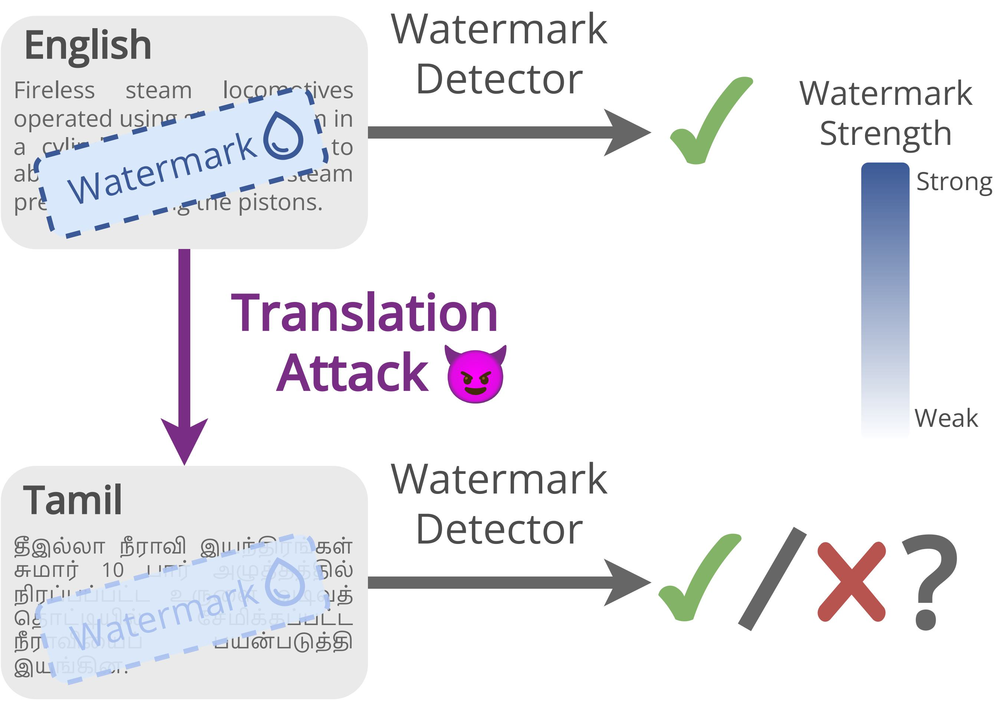
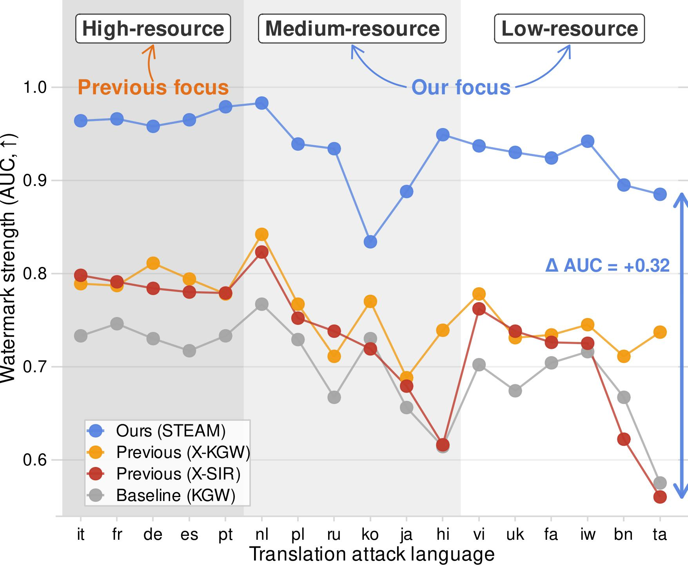
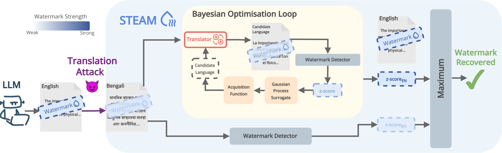

<div align="center">

# STEAM : Search-based Translation-Enhanced Approach for Multilingual Watermarking

[](https://arxiv.org/abs/2510.18019)</br>
<a href="https://www.linkedin.com/in/asim-mohamed-9a2047135/"><b>Asim Mohamed</b></a>, <a href="https://gubri.eu/"><b>Martin Gubri</b></a></br>
African Institute for Mathematical Sciences (AIMS), Parameter Lab

---

</div>

Official implementation of [**"Is Multilingual LLM Watermarking Truly Multilingual? Scaling Robustness to 100+ Languages via Back-Translation"**](https://arxiv.org/abs/2510.18019).

Current multilingual watermarking methods fail under translation attacks in medium- and low-resource languages. We trace this failure to semantic clustering, which breaks when the tokenizer vocabulary contains too few full-word tokens for a given language. STEAM addresses this by using **Bayesian optimisation** to search among **133 candidate languages** for the back-translation that best recovers watermark strength. It is compatible with any watermarking method, robust across different tokenizers and languages, non-invasive, and easily extendable to new languages.

The work was supported by [Parameter Lab](https://parameterlab.de), which provided the compute resources and covered the API costs of large language models.

## Table of Contents

- [Overview](#overview)
  - [1. Motivation](#1-motivation)
  - [2. STEAM](#2-steam-)
- [Key Results](#key-results)
- [Installation](#installation)
- [Code Structure](#code-structure)
- [Basic Workflow](#basic-workflow)
  - [Categories](#categories)
- [STEAM Detection](#steam-detection)
  - [1. Compute γ-lang Calibration](#1-compute-γ-lang-calibration)
  - [2. Run STEAM Detection](#2-run-steam-detection)
  - [3. Evaluate STEAM Results](#3-evaluate-steam-results)
- [Experiments](#experiments)
  - [Attacker-Defender Pairs](#attacker-defender-pairs)
  - [Multi-Step Pivot Attacks](#multi-step-pivot-attacks)
  - [Text Length Analysis](#text-length-analysis)
- [Core Components](#core-components)
  - [1. Text Generation (`gen.py`)](#1-text-generation-genpy-)
  - [2. Watermark Detection (`detect.py`)](#2-watermark-detection-detectpy)
  - [3. Evaluation (`eval_detection.py`)](#3-evaluation-eval_detectionpy)
  - [4. STEAM Module (`steam/`)](#4-steam-module-steam)
- [Configuration](#configuration)
- [Cite](#cite)

## Overview

### 1. Motivation

<p align="center">
  
  &nbsp;&nbsp;&nbsp;
  
</p>

> Existing multilingual watermarking methods, such as X-SIR, claim cross-lingual robustness but have been tested almost exclusively on high-resource languages. When evaluated across a wider range of languages, these methods fail to maintain watermark strength under translation attacks — especially for medium- and low-resource languages like Tamil or Bengali.
>
> This degradation arises because **semantic clustering** (grouping equivalent words like "house–maison–casa") depends heavily on tokenizer coverage: languages with fewer full-word tokens lose semantic alignment, making watermarks fragile to translation.
>
> These findings reveal that current multilingual watermarking is **not truly multilingual**, as robustness collapses when token coverage decreases or when text is translated into underrepresented languages.

### 2. STEAM 



> STEAM (**S**earch-based **T**ranslation-**E**nhanced **A**pproach for **M**ultilingual watermarking) recovers watermark strength degraded by translation attacks via multilingual back-translation. For each suspect text, STEAM uses **Bayesian Optimisation (BO)** to search for the back-translation language that best recovers the watermark signal from a pool of **133 candidate languages**.
>
> Each language is characterised by a **131-dimensional feature vector** with syntactic and phonological properties sourced from [URIEL](https://github.com/antonisa/lang2vec). BO fits a Gaussian process surrogate that models the relationship between linguistic features and observed z-scores, then selects the next candidate by maximising expected improvement. The process runs for a maximum of **20 evaluations** (3 initial + 17 BO iterations) per text.
>
> A **language-specific γ correction** replaces the fixed green token fraction γ with an empirical γ_ℓ measured on 500 human-written texts per candidate language, preventing inflated z-scores from tokenizer artefacts in low-resource languages.
>
> STEAM is **non-invasive** (no changes to generation), **watermark-agnostic** (works with KGW, X-SIR, X-KGW, etc.), **tokenizer-agnostic**, and **retroactively extensible** to new languages without regenerating watermarks.

## Key Results

Average gains over semantic clustering methods across 17 languages (3 models, 3 seeds):

| Comparison | Δ AUC | Δ TPR@1% |
|---|---|---|
| STEAM vs X-SIR | **+0.25** | **+44.0%p** |
| STEAM vs X-KGW | **+0.216** | **+30.7%p** |

Highlights:
- Average AUC above **0.965** across all language categories (high, medium, low resource)
- Largest gains on **Tamil** (+0.41 AUC) and **Hindi** (+58.8%p TPR@1%)
- Robust to **translator mismatch**: all 9 attacker-defender pairs achieve AUC > 0.94
- Robust to **multi-step pivot attacks**: average AUC of 0.884

## Installation

This project requires **Python 3.10.17**.

### 1. Create and activate a virtual environment

```bash
python3.10 -m venv .venv
source .venv/bin/activate
```

### 2. Install dependencies

```bash
pip install -r requirements.txt
```

## Code Structure

```
STEAM/
├── gen.py                           # Generate watermarked text
├── detect.py                        # Compute z-scores for baseline detection
├── utils.py                         # Shared utility functions (JSONL I/O)
│
├── steam/                           # STEAM detection module
│   ├── detector.py                  # STEAM detector with Bayesian Optimisation
│   ├── bayesian_optimization.py     # BO engine (SingleTaskGP + LogEI)
│   ├── language_features.py         # 131-D URIEL feature vectors (syntax + phonology)
│   ├── language_codes.py            # ISO 639-1 <-> ISO 639-3 conversion
│   ├── compute_gamma_lang.py        # Per-language γ calibration from validation texts
│   ├── back_translation_languages.txt  # 133 candidate probe languages
│   ├── realtime_backtranslation.py     # Google Translate wrapper (with cache + rate limiting)
│   ├── realtime_deepseek_backtranslation.py  # DeepSeek API translator
│   └── realtime_openai_backtranslation.py    # GPT-4o-mini translator
│
├── attack/                          # Translation attack modules
│   ├── google_translate.py          # Google Translate (via deep_translator)
│   ├── deepseek_translate.py        # DeepSeek API translator
│   └── openai_translate.py          # GPT-4o-mini translator
│
├── data/
│   ├── dataset/                     # mC4 prompts (en, fr, de, zh, etc.)
│   ├── dictionary/                  # Bilingual dictionaries (MUSE-based)
│   ├── mapping/                     # Semantic mappings (X-SIR / X-KGW)
│   ├── gamma_lang/                  # Per-model γ calibration files
│   └── model/                       # Pretrained transform models
│
├── evaluation/
│   ├── scripts/                     # Automated evaluation pipeline scripts
│   ├── common/                      # Shared configs (config.sh, languages.sh, utils.sh)
│   ├── eval_detection.py            # Computes AUC, TPR@FPR, F1
│   └── eval_length_classification.py # Text length analysis (short/medium/long)
│
└── watermarks/
    ├── xsir/                        # X-SIR implementation
    ├── xkgw/                        # X-KGW implementation
    └── kgw/                         # KGW implementation
```

---

## Basic Workflow

The baseline watermarking pipeline (without STEAM):

```bash
# 1. Prepare bilingual dictionaries
bash data/dictionary/download_dictionaries.sh new_supported
bash data/dictionary/build_dictionaries.sh new_supported

# 2. Generate semantic mappings
bash evaluation/scripts/generate_mapping.sh new_supported

# 3. Generate watermarked and human text
bash evaluation/scripts/generate_watermark_translate.sh new_supported
bash evaluation/scripts/generate_human_translate.sh new_supported

# 4. Evaluate baseline detection
bash evaluation/scripts/evaluate_detection_translate.sh new_supported
```

### Categories

| Category             | Languages | Description |
|---|---|---|
| `new_supported`      | 17 languages (fr, de, it, es, pt, pl, nl, ru, hi, ko, ja, bn, fa, vi, iw, uk, ta) | Main evaluation set spanning high-, medium-, and low-resource |
| `original_supported` | en, fr, de, zh, ja | Original X-SIR supported languages |
| `unsupported`        | it, es, pt, pl, nl, hr, cs, da, ko | Languages not in semantic clustering dictionaries |

Languages for each category are configured in `evaluation/common/languages.sh`.

---

## STEAM Detection

### 1. Compute γ-lang Calibration

Compute the per-language empirical green token fraction γ_ℓ from 500 human-written validation texts:

```bash
bash evaluation/scripts/compute_gamma_lang.sh
```

Output: `data/gamma_lang/<model>/kgw_seed<seed>/gamma_lang.json`

### 2. Run STEAM Detection

Run STEAM with Bayesian Optimisation on translated texts:

```bash
bash evaluation/scripts/run_steam.sh new_supported
```

This runs `steam/detector.py` for each model × seed × watermark method × language, producing:
- `mc4.<lang>.bo.z_score.jsonl` — BO-optimised z-scores for watermarked texts
- `mc4.<lang>.bo.hum.z_score.jsonl` — z-scores for human texts (using the same pivot language)

### 3. Evaluate STEAM Results

```bash
bash evaluation/scripts/evaluate_detection_steam.sh new_supported
```

---

## Experiments

### Attacker-Defender Pairs

Tests STEAM robustness when the attacker and defender use different translators. Three translators: **Google Translate**, **DeepSeek-V3.2-Exp**, **GPT-4o-mini**. Evaluated on German, Hindi, and Hebrew.

```bash
# Usage: ./run_attacker_defender.sh <attacker> <defender>
bash evaluation/scripts/run_attacker_defender.sh deepseek google
bash evaluation/scripts/run_attacker_defender.sh gpt4o deepseek
bash evaluation/scripts/run_attacker_defender.sh google gpt4o
```

Supported translators are defined in `evaluation/common/config.sh`.

### Multi-Step Pivot Attacks

Two-step translation attack: text is first translated to target language, then through a pivot language (German, Korean, or Bengali).

```bash
# Generate pivot-translated texts
bash evaluation/scripts/generate_pivot_translate.sh

# Run STEAM on pivot-attacked texts
bash evaluation/scripts/run_steam_pivot.sh
```

### Text Length Analysis

Analyses watermark detection across text length bins (short, medium, long by percentile):

```bash
bash evaluation/scripts/eval_length_classification.sh
```

---

## Core Components

### 1. Text Generation (`gen.py`)

Generates watermarked or baseline text from prompts.

```bash
python gen.py \
  --base_model meta-llama/Llama-3.2-1B \
  --input_file data/dataset/mc4.en.jsonl \
  --output_file evaluation/gen/llama-3.2-1B/new_supported/xsir_seed0/mc4.en.mod.jsonl \
  --watermark_method xsir \
  --watermark_type context \
  --mapping_file data/mapping/xsir/new_supported/mapping.json \
  --transform_model data/model/transform_model_x-sbert.pth
```

**Key Arguments**

- `--watermark_method`: `xsir`, `xkgw`, `kgw`, or `none`
- `--mapping_file`: Required for X-SIR and X-KGW methods

### 2. Watermark Detection (`detect.py`)

Computes z-scores for baseline watermark detection.

```bash
python detect.py \
  --base_model meta-llama/Llama-3.2-1B \
  --detect_file evaluation/gen/llama-3.2-1B/new_supported/xsir_seed0/mc4.en-fr.mod.jsonl \
  --output_file evaluation/gen/llama-3.2-1B/new_supported/xsir_seed0/mc4.en-fr.mod.z_score.jsonl \
  --watermark_method xsir \
  --watermark_type context \
  --mapping_file data/mapping/xsir/new_supported/mapping.json \
  --transform_model data/model/transform_model_x-sbert.pth
```

### 3. Evaluation (`eval_detection.py`)

Computes detection performance metrics including **AUC**, **TPR@FPR**, **F1**, and **ROC curves**.

```bash
python evaluation/eval_detection.py \
  --hm_zscore evaluation/gen/llama-3.2-1B/new_supported/xsir_seed0/mc4.en-fr.hum.z_score.jsonl \
  --wm_zscore evaluation/gen/llama-3.2-1B/new_supported/xsir_seed0/mc4.en-fr.mod.z_score.jsonl
```

### 4. STEAM Module (`steam/`)

The STEAM detection module. Contains the Bayesian Optimisation detector and all supporting components.

| File | Description |
|---|---|
| `detector.py` | Main STEAM detector — runs per-text BO to find the best back-translation language |
| `bayesian_optimization.py` | BO engine using SingleTaskGP surrogate and LogExpectedImprovement acquisition |
| `language_features.py` | Retrieves 131-D feature vectors (syntax_knn + phonology_knn) from URIEL via lang2vec |
| `language_codes.py` | ISO 639-1 ↔ ISO 639-3 bidirectional conversion for ~90 languages |
| `compute_gamma_lang.py` | Computes per-language empirical γ_ℓ from 500 human-written validation texts |
| `back_translation_languages.txt` | List of 133 candidate probe languages for back-translation |
| `realtime_backtranslation.py` | Google Translate wrapper with caching and rate limiting |
| `realtime_deepseek_backtranslation.py` | DeepSeek API translator (drop-in replacement) |
| `realtime_openai_backtranslation.py` | GPT-4o-mini translator (drop-in replacement) |

---

## Configuration

### Models

| Model | Abbreviation |
|---|---|
| `meta-llama/Llama-3.2-1B` | `llama-3.2-1B` |
| `CohereForAI/aya-23-8B` | `aya-23-8B` |
| `LLaMAX/LLaMAX3-8B` | `llamax3-8B` |

### Watermark Methods

| Method | Parameters |
|---|---|
| **KGW** | γ=0.25, δ=2.0, minhash seeding |
| **X-SIR** | window=5, chunk=10, δ=1.0, paraphrase-multilingual-mpnet-base-v2 |
| **X-KGW** | KGW + semantic clustering, context width=1 |

### STEAM Parameters

| Parameter | Value |
|---|---|
| Candidate languages | 133 |
| Feature dimensions | 131 (103 syntax_knn + 28 phonology_knn) |
| Initial random evaluations | 3 |
| Max BO iterations | 17 |
| Total budget per text | 20 |
| Validation texts per language | 500 |
| Surrogate model | SingleTaskGP (BoTorch) |
| Acquisition function | LogExpectedImprovement |

Settings can be modified in `evaluation/common/config.sh`, `evaluation/common/languages.sh`, and `evaluation/common/utils.sh`.

---

## Cite

If you find our work useful, please consider citing it:

```bibtex
@misc{mohamed2025multilingualllmwatermarkingtruly,
      title={Is Multilingual LLM Watermarking Truly Multilingual? Scaling Robustness to 100+ Languages via Back-Translation},
      author={Asim Mohamed and Martin Gubri},
      year={2025},
      eprint={2510.18019},
      archivePrefix={arXiv},
      primaryClass={cs.CL},
      url={https://arxiv.org/abs/2510.18019},
}
```
